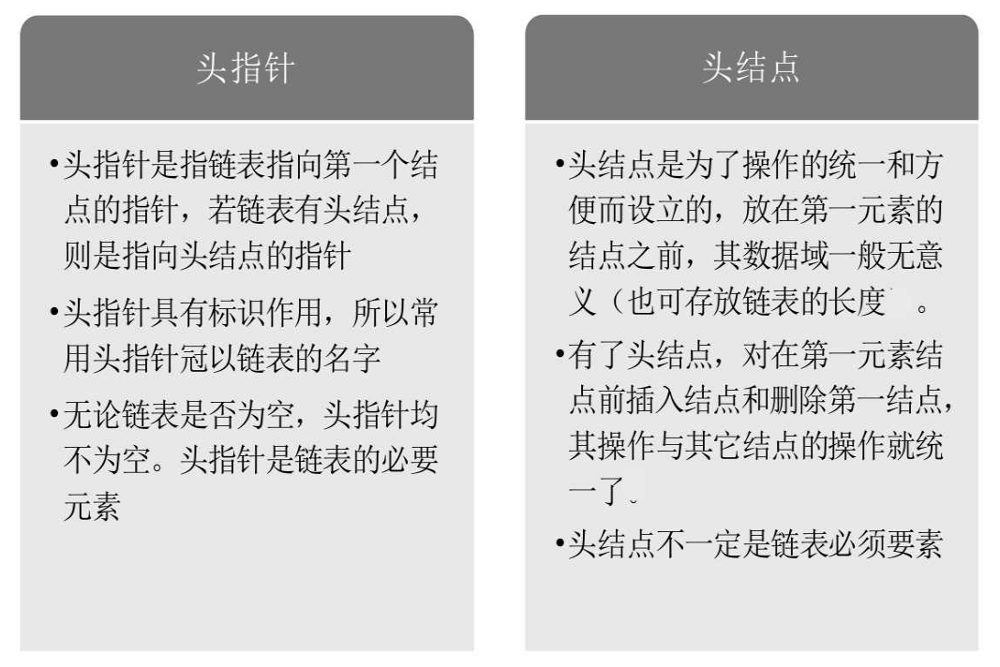

# 算法与数据结构

## 8.4 关于cpp

mod的效率很低, `n%10 = n-n/10*10`. 

递归程序设计的窄四条基本法则:

1. 基准情形.

2. 不断推进.

3. 设计法则.假设所有的调用都可以运行.

4. 合成效益法则.在递归计算在中不应该有重复计算


c++访问函数申明, 在语句末加上const.

`int read() const;`


new 返回指向新对象的指针


c++的参数调用方法

call by value按值调用:适用于不被函数改变的小对象

call by reference引址调用:适用于可以被函数改变的变量

call by constant reference按常引用调用 :适用于不可以被函数改变的大对象.

~~~c++
double avg( const vector<int> & arr, int n, bool & errorFlag);
~~~

关于按址引用,注意一下的区别

~~~c++
void fun_t1(vector<int> arr, int x)
{
    cout<<"fun1:"<<endl<<&arr<<endl<<arr[0]<<endl<<x<<endl<<&x<<endl;
}

void fun_t2(const vector<int> & arr, int & x)
{
    cout<<"fun2:"<<endl<<&arr<<endl<<arr[0]<<endl<<x<<endl<<&x<<endl;
}

void fun_t3(int * arr, int * x)
{
    //cout<<"fun2:"<<endl<<&arr<<endl<<*arr<<endl<<*x<<endl<<&x<<endl;
    printf("fun3\n%p\n%d\n%p\n%d\n", arr, *(arr+1), x, *x);
}

fun1:
0x7fffffffd630
0
66
0x7fffffffd594
fun2:
0x7fffffffd5f0
0
66
0x7fffffffd5dc
fun3
0x7fffffffd650
1
0x7fffffffd5dc
66
~~~


模板 template

函数模板,用于产生函数的公式,以适应不同类型的变量输入,可以利用模板来写泛型算法


操作符号重载

~~~c++
bool operator< (const Employee &rhs) const {
    return salay <  rhs.salay;
}
~~~


函数对象

通过调用定义带有函数的类来实现和c函数指针一样的结果

## 8.5

### 初始化列表


### cpp矩阵


## 8.6

### 第一章练习

冒泡排序比较N-1轮,每轮比较N-i-1次

for是while末尾i赋值的形式

## 8.7 基本概念

* 再比如C++中函数的参数可以传递如“void CreateBiTree(BiTree &T)”的地址变量，但在C语言中，只能传递如“void CreateBi-Tree(BiTree *T)”的指针变量。因此当你看到书中的有些代码到处都是“*”时，就用不着奇怪了。

* 现实世界中的问题千奇百怪，算法当然也就千变万化，没有通用的算法可以解决所有的问题。甚至解决一个小问题，很优秀的算法却不一定适合它。

* 最坏情况运行时间是一种保证，那就是运行时间将不会再坏了。在应用中，这是一种最重要的需求，通常，除非特别指定，我们提到的运行时间都是最坏情况的运行时间。

    平均运行时间是所有情况中最有意义的，因为它是期望的运行时间。也就是说，我们运行一段程序代码时，是希望看到平均运行时间的。可现实中，平均运行时间很难通过分析得到，一般都是通过运行一定数量的实验数据后估算出来的。

* 算法的特性：有穷性、确定性、可行性、输入、输出。

    算法的设计的要求：正确性、可读性、健壮性、高效率和低存储量需求。

* 对于优秀的算法读入数据的时间可能要比计算所花的时间更长

### 数据的逻辑结构

集合结构

线型结构

树形结构

图形结构

### 数据的物理结构

顺序存储

链式存储

### 描述抽象数据类型的标准格式

> ```c
> ADT   
> 	抽象数据类型名
> Data  
> 	数据元素之间逻辑关系的定义
> Operation  
> 	操作1    
> 		初始条件    
> 		操作结果描述  
> 	操作2
>     	......  
>     操作n
>     	......
> endADT
> ```

### 事先估计分析算法的效率

程序在计算机上运行消耗时间影响因素:

1. 算法的策略
2. 编译产生的代码质量
3. 问题的输入规模
4. 机器的执行速度

**定义:函数的渐进增长**

此时我们给出这样的定义，输入规模n在没有限制的情况下，只要超过一个数值N，这个函数就总是大于另一个函数，我们称函数是渐近增长的。

函数的渐近增长：给定两个函数f(n)和g(n)，如果存在一个整数N，使得对于所有的n>N，f(n)总是比g(n)大，那么，我们说f(n)的增长渐近快于g(n)。

**定义算法的时间复杂度**

在进行算法分析时，语句总的执行次数T(n)是关于问题规模n的函数，进而分析T(n)随n的变化情况并确定T(n)的数量级。
$$
T(n)=O(f(n))
$$
这样用大写O( )来体现算法时间复杂度的记法，我们称之为大O记法。其中$f(n)$只保留运行时间(计算次数)的最高阶,且取常数因子为1.

如:$O(1)$叫常数阶、$O(n)$叫线性阶、$O(n ^2 )$叫平方阶

> 对于if语句的计算法则
>
> 运行时间不超过判断条件加上两个条件中占用时间的较长者
>
> 递归程序就是薄纱覆盖的循环

**定义算法的空间复杂度**

算法的空间复杂度通过计算算法所需的存储空间实现，同时间复杂度类似,我们关心n足够大时候的情况:
$$
S(n)=O(f(n))
$$
其中，n为问题的规模，f(n)为语句关于n所占存储空间的函数,只保留最高阶,且取常数因子为1.

**更加规范的数学定义**
$$
\exists n_0,c使得\forall N\ge n_o \ 有 T(N)\le cf(N),记为T(N)=O(f(N))\\或者f(N)=\Omega( T(N))
$$

$$
\exists n_0,c使得\forall N\ge n_o \ 有 T(N)\ge cf(N),记为T(N)=\Omega(f(N))
$$

$$
当且仅当T(N)=O(f(N))=\Omega(f(N))时,有T(N)=\Theta(f(N))
$$


## 8.8

### 线性表

其抽象数据类型表示

> ~~~
> ADT 线性表(List)
> Data
>     线性表的数据对象集合为{a 1 , a 2 , ......, a n }，
>     每个元素的类型均为DataType。
>     其中，除第一个元素a 1 外，每一个元素有且只有一个直接前驱元素，
>     除了最后一个元素a n 外，每一个元素有且只有一个直接后继元素。
>     数据元素之间的关系是一对一的关系。
> Operation
>     InitList(*L):          初始化操作，建立一个空的线性表L。
>     ListEmpty(L):          若线性表为空，返回true，否则返回false。
>     ClearList(*L):         将线性表清空。
>     GetElem(L, i, *e):     将线性表L中的第i个位置元素值返回给e。
>     LocateElem(L, e):      在线性表L中查找与给定值e相等的元素，
>                            如果查找成功，返回该元素在表中序号表示成功；
> END ADT
> ~~~

#### 顺序储存的线型表
* 顺序存储的线性表读入或者取出数据，对于计算机来说都是相等的时间，也就是一个常数，因此用我们算法中学到的时间复杂度的概念来说，它的存取时间性能为O(1)。我们通常把具有这一特点的存储结构称为随机存取结构。

* 顺序储存的线性表适合长度不变或变化不大的数据对象

    其优点在于1. 无需为表示元素之间的逻辑关系而增加额外的储存空间 2. 可以快速的存取表中的任意元素O(1). 

    其缺点在于1. 插入和删除数据不方便O(N) 2. 当数据变化较大时难以确定表的储存空间 3. 造成储存空间的碎片化. 

#### 链式储存的顺序表

关于链表头指针和头节点的作用



链表的插入

> ~~~c
> /* 初始条件：顺序线性表L已存在，1≤i≤
>    ListLength(L)， */
> /* 操作结果：在L中第i个结点位置之前插入新的数
>    据元素e，L的长度加1 */
> Status ListInsert(LinkList *L, int i, ElemType e)
> {
>     int j;
>     LinkList p, s;
>     p = *L;
>     j = 1;
>     /* 寻找第i-1个结点 */
>     while (p && j < i)                     
>     {
>         p = p->next;
>         ++j;
>     }
>     /* 第i个结点不存在 */
>     if (!p || j > i)
>         return ERROR;                      
>     /* 生成新结点（C标准函数） */
>     s = (LinkList)malloc(sizeof(Node));    
>     s->data = e;
>     /* 将p的后继结点赋值给s的后继 */
>     s->next = p->next;                    
>     /* 将s赋值给p的后继 */
>     p->next = s;                           
>     return OK;
> }
> ~~~

链表的节点删除

> ~~~c
> /* 初始条件：链式线性表L已存在，1≤i≤ListLength(L) */
> /* 操作结果：删除L的第i个数据元素，并用e返回其值，L的长度减1 */
> Status ListDelete(LinkList *L,int i,ElemType *e) 
> { 
> 	int j;
> 	LinkList p,q;
> 	p = *L;
> 	j = 1;
> 	while (p->next && j < i)	/* 遍历寻找第i个元素 */
> 	{
>         p = p->next;
>         ++j;
> 	}
> 	if (!(p->next) || j > i) 
> 	    return ERROR;           /* 第i个元素不存在 */
> 	q = p->next;
> 	p->next = q->next;			/* 将q的后继赋值给p的后继 */
> 	*e = q->data;               /* 将q结点中的数据给e */
> 	free(q);                    /* 让系统回收此结点，释放内存 */
> 	return OK;
> }
> ~~~

如果在我们不知道第i个结点的指针位置，单链表数据结构在插入和删除操作上，与线性表的顺序存储结构是没有太大优势的。但如果，我们希望从第i个位置，插入10个结点，对于顺序存储结构意味着，每一次插入都需要移动n-i个结点，每次都是O(n)。而单链表，我们只需要在第一次时，找到第i个位置的指针，此时为O(n)，接下来只是简单地通过赋值移动指针而已，时间复杂度都是O(1)。显然，对于插入或删除数据越频繁的操作，单链表的效率优势就越是明显。

**静态链表**

用数组和数组下标来代替指针,在没有提供指针的编程语言中完成链表.

**循环链表**

链表封闭成环.

用尾指针代替头指针,方便两个循环列表的合并.

**双向链表**

在链表的指针域储存前向和后向的地址,空间换时间.

## 8.9 栈和队列

* 栈(stack)是限定仅在表尾进行插入和删除操作的线性表,先进后出(Last In First Out)LIFO

    插入:进栈,压栈

    删除:出栈,弹栈

* 队列是只允许在一端进行插入操作、而在另一端进行删除操作的线性表

### 栈的顺序储存结构

我们定义一个top变量来指示栈顶元素在数组中的位置，这top就如同中学物理学过的游标卡尺的游标，如图4-4-1，它可以来回移动，意味着栈顶的top可以变大变小，但无论如何游标不能超出尺的长度。同理，若存储栈的长度为StackSize，则栈顶位置top必须小于StackSize。当栈存在一个元素时，top等于0，因此通常把空栈的判定条件定为top等于-1。

